# RVS CIS Schema and Relationships

Current whole-CIS completion: about `76%`.

## Overview
The Java CIS keeps FoxPro master and support data in dedicated tables, while the approved transaction families use two shared transaction tables:

- `generic_documents` for header rows
- `generic_document_lines` for detail rows

The most important live transaction relationships today are:

- `Receiving -> Disbursement / C.V.`
- `Proforma -> Sales Invoice -> Cover Invoice`
- `Inventory Daily Snapshots -> Stock Report`

## Mirrored vs Java-Managed

### Mirrored from FoxPro
- `branches`
- `currencies`
- `suppliers`
- `customers`
- `trans_shippers`
- `categories`
- `brands`
- `products`
- `receiving_headers`
- `receiving_details`
- `disbursements`
- `disbursement_details`
- `generic_documents`
- `generic_document_lines`
- `inventory_daily_snapshots`
- pricing and control tables such as `net_prices`, `stop_of_week`, `contract_prices`, `special_of_week`, `invoice_special_prices`, `dated_special_prices`, `flat_prices`, `approval`, `stop_4ever`, `plimit`, `group_files`

### Managed by Java
- `app_users`
- `company_profile`
- `audit_events`
- `backup_jobs`
- `maintenance_runs`
- `inventory_post_runs`
- `inventory_post_lines`
- `inventory_ledger` for Java-side transaction movement history

## Mermaid ERD

```mermaid
erDiagram
    suppliers ||--o{ receiving_headers : supplies
    receiving_headers ||--|{ receiving_details : has
    receiving_headers ||--o{ disbursements : paid_by
    disbursements ||--|{ disbursement_details : has

    customers ||--o{ generic_documents : buys_from
    branches ||--o{ generic_documents : branch_of
    currencies ||--o{ generic_documents : values_in
    products ||--o{ generic_document_lines : used_as
    generic_documents ||--|{ generic_document_lines : has
    generic_documents ||--o| generic_documents : source_proforma_id

    products ||--o{ net_prices : priced_as
    products ||--o{ contract_prices : priced_as
    products ||--o{ stop_of_week : stopped_as
    products ||--o{ special_of_week : special_as
    products ||--o{ invoice_special_prices : invoice_special_as
    products ||--o{ dated_special_prices : dated_special_as

    products ||--o{ inventory_daily_snapshots : stocked_as
    branches ||--o{ inventory_daily_snapshots : stocked_at
    products ||--o{ inventory_ledger : moved_as
    branches ||--o{ inventory_ledger : moved_at

    app_users ||--o{ audit_events : writes
    app_users ||--o{ backup_jobs : runs
    app_users ||--o{ maintenance_runs : runs

    receiving_headers {
        bigint receiving_id PK
        varchar rr_no
        date date_received
        bigint supplier_id FK
        decimal total_amount
        decimal amount_paid
        decimal cash_on_hand
        boolean is_cancelled
    }
    receiving_details {
        bigint receiving_detail_id PK
        bigint receiving_id FK
        bigint product_id FK
        decimal qty_bought
        decimal total_cost
    }
    disbursements {
        bigint disbursement_id PK
        varchar ref_no
        bigint supplier_id FK
        date payment_date
        decimal fish_purchase_amount
        decimal total_amount
    }
    disbursement_details {
        bigint disbursement_detail_id PK
        bigint disbursement_id FK
        bigint receiving_id FK
        varchar rr_no
        decimal rr_total
    }
    generic_documents {
        bigint document_id PK
        varchar document_type
        varchar document_no
        date document_date
        varchar party_code
        varchar party_name
        varchar location_code
        varchar status
        bigint source_proforma_id FK
        varchar source_proforma_no
        varchar invoice_no
        decimal amount
        decimal total_payables
    }
    generic_document_lines {
        bigint document_line_id PK
        bigint document_id FK
        int line_no
        varchar product_code
        varchar trans_shipper_code
        varchar supplier_code
        varchar box_no
        decimal qty_out
        decimal unit_price
        decimal total_price
    }
    net_prices {
        bigint net_price_id PK
        varchar product_code
        decimal net_price
    }
    contract_prices {
        bigint contract_price_id PK
        varchar contract_type
        varchar product_code
        varchar party_code
        decimal price
    }
    stop_of_week {
        bigint stop_week_id PK
        varchar product_code
        decimal stop_price
    }
    special_of_week {
        bigint special_week_id PK
        varchar product_code
        decimal special_price
    }
    invoice_special_prices {
        bigint invoice_special_price_id PK
        varchar product_code
        decimal special_price
    }
    dated_special_prices {
        bigint dated_special_price_id PK
        date pricing_date
        varchar product_code
        decimal special_price
    }
    inventory_daily_snapshots {
        bigint inventory_snapshot_id PK
        date snapshot_date
        bigint product_id FK
        bigint branch_id FK
        decimal qty_on_hand
    }
    inventory_ledger {
        bigint inventory_ledger_id PK
        varchar transaction_type
        bigint reference_id
        int line_no
        bigint product_id FK
        bigint branch_id FK
    }
```

## Business-Critical Relationship Notes

### Receiving and C.V. / Disbursement
- `receiving_headers.total_amount` is the fish purchase total.
- `receiving_headers.amount_paid` is recomputed from `disbursement_details.rr_total`.
- `receiving_headers.cash_on_hand` is the remaining payable base that C.V. rows can consume.
- A receiving row cannot be cancelled if it already has posted C.V. amount.
- A C.V. line must belong to the selected supplier and cannot exceed the available receiving balance.

### Proforma, Sales Invoice, and Cover Invoice
- `PROFORMA` rows live in `generic_documents`.
- `SALES_INVOICE` rows also live in `generic_documents`.
- `generic_documents.source_proforma_id` and `source_proforma_no` link one invoice back to one Proforma.
- One Proforma can back one active Sales Invoice only.
- When an invoice is deleted or cancelled, the source Proforma is reopened unless another active invoice still points to it.
- Cover Invoice fields are stored on the Sales Invoice header row.
- Sales Invoice pricing uses the FoxPro precedence chain:
  1. base price from the selected pricing code (`A/B/C/D/E/F/G/S/L`)
  2. `net_prices` from `nfile.dbf`
  3. `contract_prices` of type `TRANSHIPPER` from `cprc_d.dbf`
  4. `invoice_special_prices` from `sfile.dbf`
  5. `special_of_week` from `super_s.dbf`
  6. `dated_special_prices` from `super_hd.dbf`
  7. `contract_prices` of type `TRANSHIPPER_NEW` from `price_d_new.dbf`
- Sales Invoice totals use the FoxPro `sale_e.SCT` math:
  - discount applies only to non-special lines
  - `freight = ((SSC + RATE2) * KGS) + VAT + STAMP`
  - `product sales = total line amount - non-special discount`
  - `total payables = product sales + packing charges - DOA + freight + misc`

### Inventory
- `inventory_daily_snapshots` is the imported FoxPro `DAY_INV` source used by Stock Report and by quantity lookups.
- `inventory_ledger` records Java-side inventory movement rows created by transactions such as receiving.
- Opening-stock go-live packaging keeps the latest `inventory_daily_snapshots` date and clears old transaction history if chosen.

## Current Schema Support in Code
- `AppBootstrap` ensures the transaction columns needed by Proforma, Sales Invoice, Cover Invoice, and stock snapshots exist.
- `AppBootstrap` also ensures transaction lookup indexes used by the live screens, including:
  - `generic_documents(document_type, status, document_no)`
  - `generic_documents(document_type, status, party_code, document_no)`
  - `generic_documents(document_type, status, document_date, document_no)`
  - `generic_documents(document_type, source_proforma_id, status)`
  - `generic_document_lines(document_id, line_no)`
  - `receiving_headers(rr_no)`
  - `receiving_headers(date_received, rr_no)`
  - `receiving_headers(supplier_id, date_received, rr_no)`
  - `receiving_details(receiving_id, line_no)`
  - `disbursements(ref_no)`
  - `disbursements(supplier_id, payment_date, ref_no)`
  - `disbursement_details(receiving_id, disbursement_id)`
  - `inventory_daily_snapshots(product_id, snapshot_date)`
  - `inventory_ledger(transaction_type, reference_id, line_no)`
  - `invoice_special_prices(product_code, is_active)`
  - `dated_special_prices(product_code, pricing_date, is_active)`

## Import and Mirror Notes
- FoxPro sources:
  - `PUR_H.dbf` / `PUR_D.dbf` -> `receiving_headers` / `receiving_details`
  - `disbursement.dbf` -> `disbursements`
  - `OE_H.DBF` / `OE_D.DBF` -> `generic_documents` / `generic_document_lines` with `document_type = 'PROFORMA'`
  - `SALE_H.DBF` / `SALE_D.DBF` -> `generic_documents` / `generic_document_lines` with `document_type = 'SALES_INVOICE'`
  - `SALE_C.DBF` -> additional invoice / cover-invoice reference data
  - `nfile.dbf` -> `net_prices`
  - `cprc_d.dbf` / `price_d_new.dbf` / `csupp_d.dbf` -> `contract_prices`
  - `sfile2.dbf` -> `stop_of_week`
  - `sfile.dbf` -> `invoice_special_prices`
  - `super_s.dbf` -> `special_of_week`
  - `super_hd.dbf` -> `dated_special_prices`
  - `CURRENCY.DBF` -> `currencies`
  - `DAY_INV.DBF` -> `inventory_daily_snapshots`
- Duplicate handling:
  - master/support rows: last DBF row wins
  - transaction headers: newest usable business row wins when dedupe is needed
  - detail rows: FoxPro line order is preserved through `line_no`
  - deleted FoxPro rows are not re-imported

## Local-First / Live-Soon Notes
- Local full mirror remains the working source during development and parity checks.
- Fresh go-live packaging is a separate packaging step, not the normal local verification mode.
- The ERD is meant to stay in sync with the real code and serve as a cutover reference when the app replaces FoxPro.
